# MCP Grid Studio

> **One MCP server to rule them all.** Dynamically discover, launch, and orchestrate any number of MCP servers -- keeping your AI agent's context lean and your system resources efficient.

**By [IB-QA](https://github.com/IB-QA)** -- Intelligent Build & Quality Automation

[](https://github.com/IB-QA/MCPServerGridStudio/releases)
[](https://pypi.org/project/mcp-grid/)
[](https://pypi.org/project/mcp-grid/)
[](https://marketplace.visualstudio.com/items?itemName=IB-QA.mcp-grid)
[](LICENSE)
[](https://grid.mcpstudio.qabots.diy)

---

## What is MCP Grid Studio?

MCP Grid Studio is a **meta-MCP server** -- a single MCP server that manages all your other MCP servers. Instead of loading 100+ tools from dozens of servers into your agent's context, MCP Grid exposes **21 management tools** that let the agent start, use, and stop servers dynamically.

```mermaid
flowchart LR
    A["🤖 AI Agent"] -->|"21 tools"| G["⚡ MCP Grid"]
    G -->|"On-demand"| S1["Playwright"]
    G -->|"On-demand"| S2["GitHub"]
    G -->|"On-demand"| S3["SQLite"]
    G -->|"OpenAPI"| API["Any REST API"]
    G -->|"WebSocket"| WF["Enterprise Workflows"]
    G -->|"REST API"| EXT["VS Code Extension"]
```



## Why MCP Grid Studio?

| Without MCP Grid | With MCP Grid |
|-----------------|---------------|
| 100+ tools bloat context window | 21 meta-tools, actual tools load on demand |
| Servers run idle, wasting resources | Auto-start on demand, auto-shutdown when idle |
| No visibility into tool performance | Built-in metrics dashboard |
| Can't use REST APIs as MCP tools | OpenAPI spec → instant MCP tools |
| Enterprise workflows stuck in browser | Execute workflow chains from your IDE |
| Managing configs is painful | Visual marketplace + one-click install |

---

## Quick Start

### 1. Install

```bash
# Recommended (no install needed)
uvx mcp-grid

# Or via pip
pip install mcp-grid
```

### 2. Add to Your Agent

Add to `~/.cursor/mcp.json`:

```json
{
  "mcpServers": {
    "mcp-grid": {
      "command": "uvx",
      "args": ["mcp-grid"]
    }
  }
}
```

### 3. Install the VS Code Extension

Download the latest `.vsix` from [Releases](https://github.com/IB-QA/MCPServerGridStudio/releases) and:

```bash
code --install-extension mcp-grid-studio.vsix
```

### 4. Start Using

Ask your agent:

> *"Use MCP Grid to discover available servers, then activate the Playwright server and navigate to example.com"*

The agent will call `discover_servers`, `configure_server`, `activate_server`, and `call_tool` automatically.

---

## Features

### Dynamic Server Management


### OpenAPI-to-MCP Adapter

Turn **any REST API** into MCP tools instantly:

```mermaid
flowchart LR
    SPEC["OpenAPI Spec<br/>(URL / File / Paste)"] --> PARSE["Parser<br/>3.x / Swagger 2.0"]
    PARSE --> TOOLS["MCP Tools<br/>(auto-generated)"]
    TOOLS --> AUTH["Auth Config<br/>(API Key / Bearer / OAuth2)"]
    AUTH --> CALL["call_api_tool()<br/>→ HTTP Request → Response"]
```



- Import from URL, file path, or paste raw JSON/YAML
- All endpoints become callable MCP tools
- Customize names, descriptions, enable/disable per endpoint
- Auth: API Key, Bearer Token, Basic Auth, OAuth2 Client Credentials

### Enterprise Platform Integration

Connect to enterprise AI workflow platforms and execute chains directly from your IDE:

- **JWT + WebSocket** authentication
- **Real-time streaming** of workflow results
- **Zero persistence** -- all tokens in-memory only
- **Auto-heartbeat** for long-running workflows

### VS Code Extension

| Panel | Purpose |
|-------|---------|
| **Servers** | Browse installed servers, view tools, toggle enable/disable |
| **Active Instances** | Monitor running instances, view tools list, stop instances |
| **Metrics** | Real-time stats: total calls, success rate, avg latency |
| **Marketplace** | Browse verified catalog, one-click install, configure |
| **Dashboard** | Full metrics webview with per-server breakdowns |

### Performance Metrics

All metrics stay **local on your machine** (SQLite). Nothing is sent externally:

| Collected | NOT Collected |
|-----------|--------------|
| Tool call counts | Tool call content or arguments |
| Latency (ms) | What tools are used for |
| Success / failure | User identity |
| Server start/stop events | Credentials or tokens |

Metrics collection can be **disabled entirely** in extension settings.

---

## 21 Agent Tools

### Local MCP Servers (9)

| Tool | Description |
|------|-------------|
| `discover_servers` | Browse catalog by category, search, or tag |
| `configure_server` | Create an instance with options |
| `activate_server` | Start server, discover tools |
| `call_tool` | Execute a tool on an active instance |
| `deactivate_server` | Stop and free resources |
| `get_server_status` | Check status, uptime, stats |
| `list_active_tools` | List all tools on active instances |
| `parallel_call` | Run multiple tool calls simultaneously |
| `import_mcp_config` | Import from `mcp.json` format |

### OpenAPI Adapter (6)

| Tool | Description |
|------|-------------|
| `import_openapi_spec` | Import any OpenAPI/Swagger spec |
| `list_api_tools` | Browse discovered endpoints |
| `configure_api_auth` | Set credentials (memory-only) |
| `customize_api_tool` | Rename, describe, toggle endpoints |
| `call_api_tool` | Execute an API endpoint |
| `get_api_tool_schema` | Get full input schema |

### Enterprise Platform (6)

| Tool | Description |
|------|-------------|
| `connect_platform` | Connect via JWT |
| `list_workflows` | Browse workflow chains |
| `get_workflow_details` | Inspect chain components |
| `execute_workflow` | Run via WebSocket |
| `get_platform_status` | Check connection health |
| `disconnect_platform` | Disconnect, clear tokens |

---

## Pre-Built Server Catalog

| Category | Servers |
|----------|---------|
| **Browser & Automation** | Playwright MCP, Puppeteer MCP |
| **Data & Analytics** | SQLite MCP, PostgreSQL MCP |
| **Development** | GitHub MCP, Git MCP, Filesystem MCP |
| **Search & Web** | Brave Search MCP, Fetch MCP |
| **Utilities** | Time MCP, Memory MCP |

Browse the full catalog at **[grid.mcpstudio.qabots.diy](https://grid.mcpstudio.qabots.diy)**

---

## Architecture

```mermaid
flowchart TB
    subgraph Cloud["☁️ Marketplace (GitHub Pages)"]
        CAT["Catalog JSON"]
    end

    subgraph Local["💻 Your Machine"]
        subgraph Agent["AI Agent"]
            LLM["Cursor / Claude Desktop"]
        end

        subgraph Grid["MCP Grid Studio"]
            META["21 Meta-Tools"]
            MGMT["Management API"]
            REG["Server Registry"]
            INST["Instance Manager"]
            METR["Metrics Collector"]
        end

        subgraph Ext["VS Code Extension"]
            SB["Sidebar Panels"]
            DB["Dashboard"]
            MK["Marketplace"]
        end

        subgraph Instances["Server Instances"]
            I1["Playwright"]
            I2["GitHub"]
            I3["SQLite"]
        end
    end

    CAT -->|"Hourly sync"| MK
    LLM <-->|"MCP Protocol"| META
    META --> REG
    META --> INST
    META --> METR
    INST --> I1 & I2 & I3
    MGMT <-->|"REST + WS"| SB & DB & MK

    style Cloud fill:#f0f9ff,stroke:#0284c7
    style Local fill:#fafafa,stroke:#a3a3a3
    style Grid fill:#f3e8ff,stroke:#7c3aed
    style Instances fill:#e8ffe8,stroke:#16a34a
```



---

## Security

| Principle | Guarantee |
|-----------|-----------|
| **Zero Persistence** | Credentials and tokens held in-memory only. Gone when the process stops. |
| **Local First** | All processing on your machine. Management API binds to localhost only. |
| **No Telemetry** | No data sent to external services. No analytics. No crash reports. |
| **Encrypted Storage** | Extension preferences use VS Code's OS keychain integration. |
| **Force Updates** | Critical security patches deploy automatically via the marketplace. |
| **Resource Isolation** | Each agent session gets isolated server instances. |
| **Verified Marketplace** | Every catalog server passes automated security and stability checks. |

See the [Security wiki page](https://github.com/IB-QA/MCPServerGridStudio/wiki/Security) for full details.

---

## For Enterprises

MCP Grid Studio is built with enterprise requirements in mind:

- **SOC 2 Type II compatible** -- No persistent credential storage
- **GDPR compatible** -- No PII collected
- **Firewall friendly** -- Outbound HTTPS/WSS only
- **Air-gap compatible** -- Works on-premise without internet
- **Custom platform integrations** -- Connect to your internal AI workflow platforms

**Need a custom integration?** We offer dedicated plugin development for enterprise platforms, including custom authentication flows, workflow adapters, and private marketplace configurations. Reach out at **enterprise@qabots.diy** or open a [private discussion](https://github.com/IB-QA/MCPServerGridStudio/discussions).

---

## Documentation

| Resource | Link |
|----------|------|
| **Wiki** | [github.com/IB-QA/MCPServerGridStudio/wiki](https://github.com/IB-QA/MCPServerGridStudio/wiki) |
| **Marketplace** | [grid.mcpstudio.qabots.diy](https://grid.mcpstudio.qabots.diy) |
| **Getting Started** | [Wiki: Getting Started](https://github.com/IB-QA/MCPServerGridStudio/wiki/Getting-Started) |
| **Agent Tools Reference** | [Wiki: Agent Tools Reference](https://github.com/IB-QA/MCPServerGridStudio/wiki/Agent-Tools-Reference) |
| **Roadmap** | [Wiki: Roadmap](https://github.com/IB-QA/MCPServerGridStudio/wiki/Roadmap) |

## Contributing

We welcome contributions! See the [Contributing guide](https://github.com/IB-QA/MCPServerGridStudio/wiki/Contributing) for details.

## Acknowledgements

- [Accenture/mcp-bench](https://github.com/Accenture/mcp-bench) -- Connector patterns
- [mcp-use/mcp-use](https://github.com/mcp-use/mcp-use) -- Meta-tools pattern
- [universal-mcp/universal-mcp](https://github.com/universal-mcp/universal-mcp) -- Credential store design
- [jlowin/fastmcp](https://github.com/jlowin/fastmcp) -- The framework MCP Grid is built on

## License

MIT -- see [LICENSE](LICENSE) for details.

---

Built with care by **[IB-QA](https://github.com/IB-QA)** -- Intelligent Build & Quality Automation
